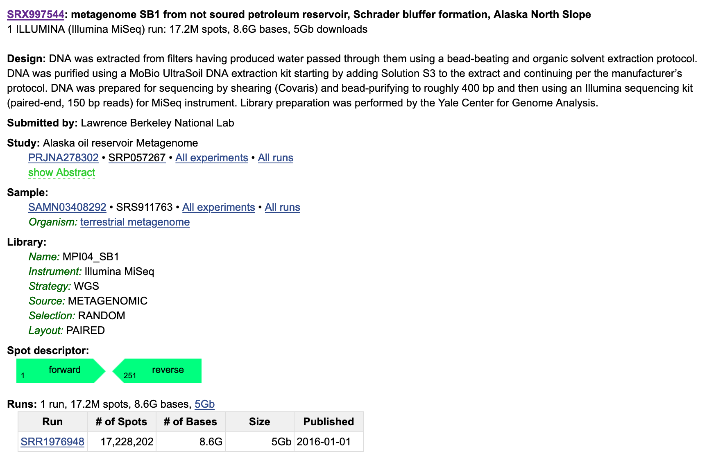
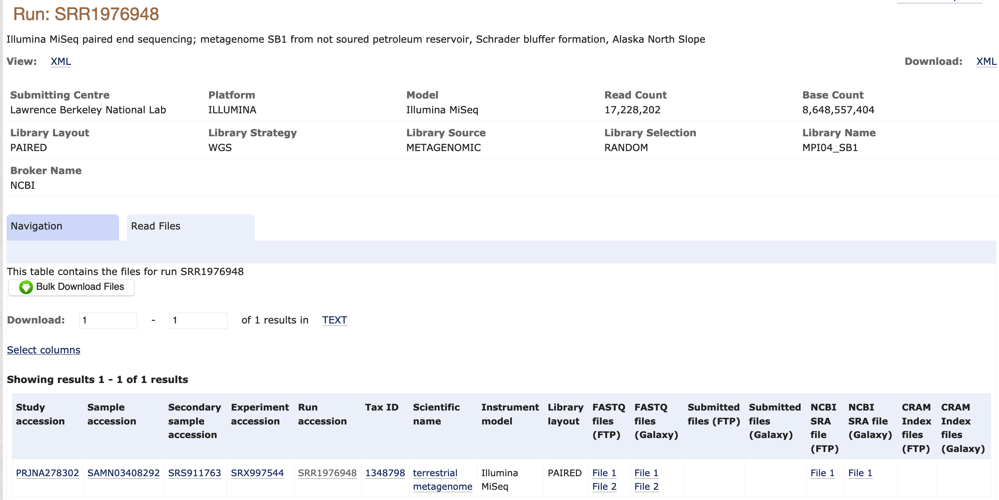

We will be working with a metagenome sample from an Alaskan Oil Reservoir sequenced in [this study](https://mbio.asm.org/content/7/1/e01669-15).
The sample is named SB1 because it was sampled from the Schrader Bluff Formation.

We will start working with this sample by downloading it. 
Then, we will assess its quality using FastQC. 

There are many ways to discover and download sequencing data. 
In this case, we are using a sample that was detailed in a paper. 
When this is the case, it is usually easiest to find this sample by looking at the paper itself. 
We can see on Page 9 that the authors have documented the accession numbers of their samples (metagenome-assembled genomes and raw sequences) in the paper:


We can use this information to find a link to use to download the raw sequencing data. 
We see that the raw reads are in GenBank under the accession `SRP057267`. 
Let's navigate to GenBank and see what these files look like there.
Searching all databases for `SRP057267`, we find the following result: https://www.ncbi.nlm.nih.gov/sra/SRP057267
We see that the raw reads are in the Sequence Read Archive. 
The last sample is the one we are interested in: `metagenome SB1 from not soured petroleum reservoir, Schrader bluffer formation, Alaska North Slope`. 

Clicking on this link, we see the following description:



If we click on the run link `SRR1976948`, this takes us to the SRA Run Browser. 
The Run Browser provides some information about the raw reads, including a estimate of taxonomic composition. 
It's worth it to explore the Run Browser, but there are easier ways to download data than using the SRA. 
The SRA is mirrored by the [European Nucleotide Archive (ENA)](https://www.ebi.ac.uk/ena).
We can search for our accession number on the ENA as well. 
If we click on the result, we see the following page:



We can click directly on the `FASTQ files (FTP)` to download them to our computer.
Alternative, we can copy the links and use these to download the files to a remote computer like Farm.

Before we download these files, let's set up a directory structure that will help us stay organized.

```
cd ~
mkdir 2020_rotation_project
cd 2020_rotation_project
mkdir raw_data
cd raw_data
```

Then, we can download the data into our `raw_data` directory.

```
wget ftp://ftp.sra.ebi.ac.uk/vol1/fastq/SRR197/008/SRR1976948/SRR1976948_1.fastq.gz
wget ftp://ftp.sra.ebi.ac.uk/vol1/fastq/SRR197/008/SRR1976948/SRR1976948_2.fastq.gz
```


Note: if you ever need to download >10 accessions from the SRA, the `sra-toolkit` is a great tool to do this with!
However, we find `sra-toolkit` cumbersome when only a couple accessions need to be downloaded.

