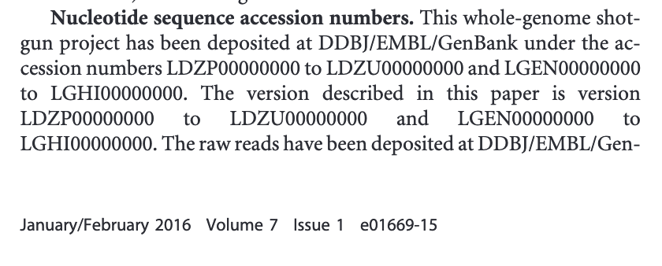
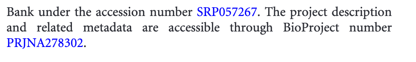

We will be working with a metagenome sample from an Alaskan Oil Reservoir sequenced in [this study](https://mbio.asm.org/content/7/1/e01669-15).
The sample is named SB1 because it was sampled from the Schrader Bluff Formation.

We will start working with this sample by downloading it. 
Then, we will assess its quality using FastQC. 

There are many ways to discover and download sequencing data. 
In this case, we are using a sample that was detailed in a paper. 
When this is the case, it is usually easiest to find this sample by looking at the paper itself. 
We can see on Page 9 that the authors have documented the accession numbers of their samples (metagenome-assembled genomes and raw sequences) in the paper:

We can use this information to find a link to use to download the raw sequencing data. 
