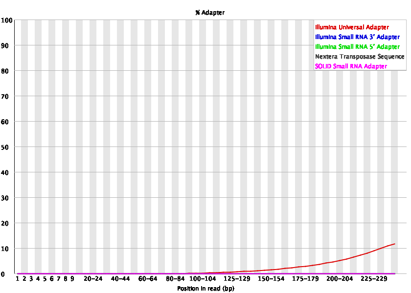
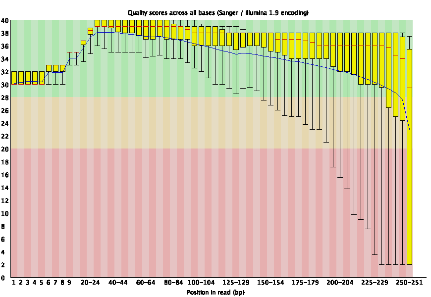

After [downloading and QCing sequencing data](05_starting_with_data.md), the next step in many pipelines is to adapter and error trim the reads.
However, deciding when and how to trim data is pipeline dependent. 
Below, we define a few types of trimming and explore a use cases and how trimming recommendations may change with different applications.
Although this project focuses on metagenomic sequencing, we include other applications in this discussion.

## Types of trimming

+ **Adapter and barcode trimming**: Adapter sequences are added to a sample library to aid in the physical process of sequencing.
They are ubiquitous within a certain chemistry, and so are present across all sequenced samples. 
Barcodes are unique nucleotide sequences used to identify a specific sample when multiple samples are sequenced in a single lane.
After barcoded samples are separated from one another in a process called demultiplexing, barcodes are no longer needed in a sequence. 
It is generally a good idea to remove adapters and barcodes from sequencing samples before proceeding with any downstream application. 
However, if you are using a pipeline that involves matching between reads and a quality reference, you may get similar results with or without adapter trimming. For quick estimation 
+ **Quality trimming**: Quality trimming removes low-quality bases from sequences reads. The user can set the stringency cut off for "low quality" by indicating a phred score at which to trim. 
+ **K-mer trimming**: K-mer trimming removes k-mers that occur very few times in a sequencing dataset. In reads with sufficient sequencing depth, we expect real k-mers to occur multiple times. When a single sequencing error occurs in a read, this produces *k* erroneous k-mers. K-mer trimming trims a read to remove all of these k-mers. K-mer trimming does not rely on information from the sequencer like phred scores, but instead on the biological signal in the reads themselves.

## When and how to trim?

Trimming is a balance of removing artificial or incorrect nucleotides and retaining true nucleotides in sequencing data. 
What and when to trim therefore changes with the sequencing application, and with the sequencing data itself. 
Below we explore some trimming use cases to help develop an intuition for what type of trimming is necessary and when.


+ **Single-species genomic sequencing for assembly**: 
Let's imagine we have just sequenced an *Escherichia coli* isolate with 100X coverage and would like to assemble the isolate. 
We would first want to remove adapters and barcodes to prevent these sequences from ending up in our final assembly. 
Then, stringent quality and k-mer trimming may be appropriate, because we have high coverage data; even if we were to stringently trim and were only left with 50% of our original number of reads, we would still have 50X coverage of very high quality data. 
50X coverage is sufficient to acheive a good bacterial assembly in most cases. 
+ ***de novo* RNA-sequencing assembly** Now let's imagine we have sequenced the transcriptome of our favorite species which does not currently have a reference transcriptome.
Because RNA transcripts have different abundance profiles, we can't use average coverage in the same way as we used it for single-species genomic sequencing. 
We need to be more careful when we k-mer and error trim so as not to accidentally remove low-abundance reads that represent true transcripts. We would likely use light quality trimming (e.g. a phred score of ~5). For k-mer trimming, we would only trim reads that contain high-abundance k-mers.
+ **Metagenome *de novo* assembly** Trimming metagenomic reads for *de novo* assembly is similar to trimming RNA-sequencing reads for *de novo* transcriptome assembly. Because there are often low-abundance organisms that have low-coverage in our sequencing datasets, we need to be careful not to accidently remove these during trimming. 
+ **Metagenome read mapping** 
In referenced-based analyses including mapping of metagenomic reads to a set of reference genomes, reads will often map even when they contain adapters and barcodes. 
However, in some cases, the presence of adapters and barcodes does prevent mapping, so it is safer to remove all barcodes and adapters. 


## References about trimming

Many scientific studies have explored the trimming parameter space in an effort to make recommendations for different applications. 
We include some of these studies below.

+ [On the optimal trimming of high-throughput mRNA sequence data](https://www.frontiersin.org/articles/10.3389/fgene.2014.00013/full)
+ [An Extensive Evaluation of Read Trimming Effects on Illumina NGS Data Analysis](https://journals.plos.org/plosone/article?id=10.1371/journal.pone.0085024)


## Adapter trimming

We saw using FastQC that the Illumina Universal Adapter was present in our sample. 



We also saw that the sequence read quality dropped dramatically toward the end of the read.



We will remove both of these sequences using Trimmomatic. 

Trimmomatic doesn't take very much RAM, but it will perform faster with more threads (CPUs). 
Here's an examples `srun` command to start an interactive job on a slurm cluster in which to run the trimmomatic commands:

```
srun -p bmh -J trim -t 10:00:00 --mem=8gb -c 2 --pty bash
```

Once you're in an `srun` session, activate your rotation environment and install trimmomatic

```
conda activate dib_rotation
conda install -y trimmomatic
```

We can now trim our data!
Let's set up our directory structure:

```
cd ~/2020_rotation_project
mkdir -p trim
cd trim
```

And link in our raw data.
```
ln -s ~/2020_rotation_project/raw_data/*fastq.gz .
```

We also need an `adapters.fa` file that contains the Illumina Universal Adapter.
We've created an adapter file that contains many (all?) of the Illumina adapters so it can be used to adapter trim across experiments.

```
wget https://raw.githubusercontent.com/dib-lab/dib_rotation/master/_static/adapters.fa
```

We can now use trimmomatic to adapter and quality trim our data.

```
trimmomatic PE SRR1976948_1.fastq.gz SRR1976948_2.fastq.gz \
        SRR1976948_1.trim.fastq.gz SRR1976948_1.se.fastq.gz \
        SRR1976948_2.trim.fastq.gz SRR1976948_2.se.fastq.gz \
        ILLUMINACLIP:adapters.fa:2:30:15 \
        LEADING:2 TRAILING:2 \
        SLIDINGWINDOW:4:2 \
        MINLEN:25
```

> **Command Breakdwon**
> 
> Trimmomatic is a java program that we call from the command line. Each arguments is followed by a colon, and then its value.
> * `PE` - this is specified because we are working with paired-end data with forward and reverse reads.
> * `SRR1976948_1.fastq.gz SRR1976948_2.fastq.gz ` - the first two positional argument we are providing are the input fastq files. 
> * `SRR1976948_1.trim.fastq.gz` - the next positional argument specifies the output file name for forward paired-end sequences that survive trimming and whose mate survives trimming.
> * `SRR1976948_1.se.fastq.gz` - the next positional argument specifies the output file name for forward paired-end sequences that survive trimming but whose mate does not survive trimming. These files are then repeated fro the reverse sequence.
> * `ILLUMINACLIP:TruSeq2-SE.fa:2:30:15` - the argument "ILLUMINACLIP" the file that contains the adapter sequences, then 3 numbers: "2" which states how many mismatches between the adapter sequence and what's found are allowed; "30" species how similar adapters in forward and reverse reads must be; and "15" which specifies how accurate the match must be
> * `LEADING:2 TRAILING:2` - both of these state the minimum quality score at the start or end of the read, if lower, it will be trimmed off
> * `SLIDINGWINDOW:4:2` - this looks at 4 basepairs at a time, and if the average quality of that window of 4 drops below 2, the read is trimmed there
> * `MINLEN:25` - after all the above trimming steps, if the read is shorter than 25 bps, it will be discarded

We only trim sequences with a low quality score of 2.
Recall from our FastQC lesson that a quality score of 10 indicates a 1 in 10 chance that the base is inaccurate. 
A score of 20 is a 1 in 100 chance that the base is inaccurate. 30 is 1 in 1,000. And 40 in 1 in 10,000. 
By using a score of 2, we are more likely to keep data that has a high probability of being accurate. 

## k-mer trimming

Next, let's k-mer trim our data. 
This will take 20GB of RAM and a few hours to complete. 
Here's an example `srun` command to start an interactive job on a slurm cluster in which to run the k-mer trimming commands:

```
srun -p bmh -J khmer -t 20:00:00 --mem=21gb -c 1 --pty bash
```

We need to install the software we will use to perform k-mer trimming, `khmer`.
Make sure you activate the conda environment you are using for this project with `conda activate env_name`.

```
conda install -y khmer
```

Once `khmer` is installed, we can use it for k-mer trimming. 
Let's get our files and directories set up 
```
cd ~/2020_rotation_project
mkdir -p abund_trim
cd abund_trim
```

And link in our files from adapter trimming.
```
ln -s ../trim/*trim.fastq.gz .
```

Then we can run k-mer trimming!
The first line of this command interleaves our paired end reads, putting them in one file where forward and reverse reads alternate on each line.
The second line of this command performs the k-mer trimming. 

```
interleave-reads.py ${i}_1.fastq.gz ${i}_2.fastq.gz | 
        trim-low-abund.py --gzip -C 3 -Z 18 -M 20e9 -V - -o $i.abundtrim.fq.gz
```
