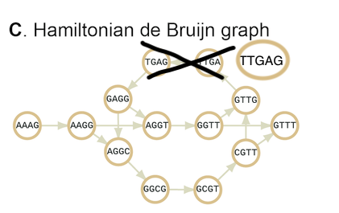
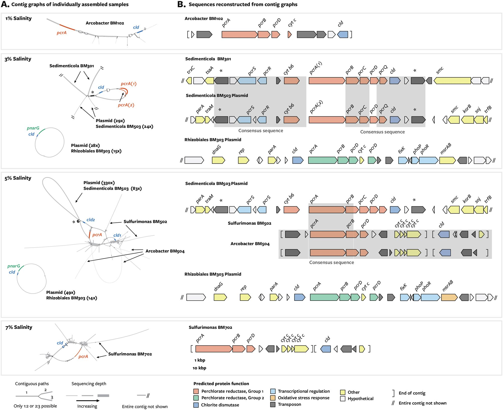
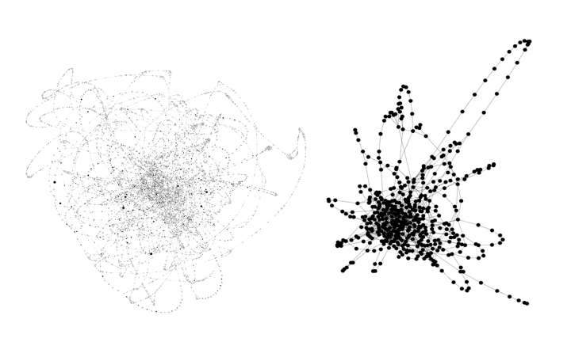

In the [previous lesson](07_taxonomic_discovery_with_sourmash.md), we used sourmash to determine the approximate taxonomic composition of our metagenome sample. 
Sourmash performs quick exact matching between the k-mers in your sample and k-mers in a databases -- this means that a sequence must have been previously sequenced and be in a database in order for us to be able to label it in our sample. 
We often cannot label a lot of the sequences in our sample, especially if that sample comes from a novel environment that has not be sequenced in the past. 
We saw this in the previous lesson, where we were only able to classify ~90% of the reads in our sample.

```
== This is sourmash version 3.0.1. ==
== Please cite Brown and Irber (2016), doi:10.21105/joss.00027. ==

loaded 1 LCA databases. ksize=31, scaled=10000
selecting specified query k=31
loaded query: SRR1976948... (k=31)

overlap     p_query p_match
---------   ------- --------
2.5 Mbp       0.2%   96.9%      unassigned Methanomicrobiales archaeon 53_19
2.4 Mbp       0.2%   99.2%      Methanobacterium sp. 42_16
2.3 Mbp       0.2%  100.0%      Desulfotomaculum sp. 46_80
2.3 Mbp       0.2%  100.0%      unassigned Actinobacteria bacterium 66_15
2.1 Mbp       0.2%   97.7%      Desulfotomaculum sp. 46_296
2.1 Mbp       0.2%   99.0%      Methanosaeta harundinacea
2.0 Mbp       0.2%   99.0%      unassigned Marinimicrobia bacterium 46_43
1.9 Mbp       0.2%  100.0%      unassigned Bacteroidetes bacterium 38_7
1.9 Mbp       0.2%   55.1%      unassigned Thermotogales bacterium EBM-48
```

## Analysis options for metagenome samples

To get more information out of a metagenomics sample, we have five options. 
1) **Align reads to the genomes that had sourmash matches.** sourmash performs exact matching of k-mers.
K-mers of size 31 are fairly specific.
Even if a sequence had 30 basepairs exactly in common with another sequence, if the 31st is different, it would not count as a match.
Aligning reads to close relatives is a more lenient approach, and could lead to 5-10% more reads being classified.
This is pretty good, but there are ways to do better.

2) ***de novo* assemble and bin the reads into metagenome assembled genomes.**
*de novo* assembly and binning are reference-free approaches to produce metagenome-assembled genomes (bins) from metagenome reads.
*de novo* assembly works by finding overlaps between reads and assembling them into larger "contiguous sequences" (usually shortened to contigs).
Depending on the depth, coverage, and biological properties of a sample, these contigs range in size from 500 base pairs to hundreds of thousands of base pairs.
These assemblies can then be binned into metagenome-assembled genomes. Most binners use tetranucleotide frequency and abundance information to bin contigs.
A tetranucleotide is a 4 base pair sequence within a genome.
Almost all tetranucleotides occur in almost all genomes, however the frequency that they occur in a given genome is usually conserved (see [here](http://peteranoble.com/noble_pubs/noble_1998.pdf)).
So, binners exploit this information and calculate tetranucleotide frequency for all contigs in an assembly, and group the contigs together that have similar frequencies.
This is also coupled with abundance information; if two contigs belong together, they probably have the same abundance because they came from the same organism in a sample.
These approaches allow researchers to ask questions about the genomes of organisms in metagenomes even if there is no reference that has been sequenced before.
For this reason, they are both very popular and very powerful.
However, both assembly and binning suffer from biases that lead to incomplete results.
Assembly fails when either 1) an area does not have enough reads to cover the region (low coverage) and 2) when the region is too complicated and there are too many viable combinations of sequences so the assembler doesn't know how to make a decision.
This second scenario can occur when there are a lot of errors in the reads, or when there is a lot of strain variation in a genome. 
In either case, the assembly breaks and outputs fragmented contigs, or no contigs at all.
Although tetranucleotide frequency and abundance information are strong signals, tetranucleotide frequency can only be reliably estimated on contigs that are >2000 base pairs.
Because many things fail to assemble to that length, they are not binned. 
To give an idea of how much is missed by *de novo* assembly and binning, consider our sourmash results.
The sample that we are analyzing was originally analyzed with a *de novo* assembly and binning pipeline.
The high-quality bins were then uploaded to GenBank and are now part of the database. 
Look at the sourmash output (above). 
Any genome match that ends in two numbers separated by an underscore (e.g. 46_43) is a *de novo* metagenome-assembled genome produced by the original analysis.
Even with the exact genomes in our sample in the database, we were only able to classify 90% of the k-mers in our sample.
This leaves a lot of data on the table.

3) **Continue the analysis with gene-level techniques.** Often times, many more contigs will assemble than will bin. 
In cases like this, it's possible to do a gene-level analysis of a metagenome where you annotate open reading frames (ORFs) on the assembled contigs.
This type of analysis can give you an idea of the functional potential in our metagenome.

4) **Continue the analysis with read-based techniques.**
If something has no known reference and doesn't assemble or bin, what can you do? 
There are many tools that work directly on metagenome reads to estimate taxonomy or function (e.g. gene identity).
These tools include Kraken and mifaser. 
We've had varying degrees of success with this type of approach, depending on the sample being analyzed.

5) **Exploit connectivity of DNA sequences to assign more reads to the pangenome of sourmash matches.**
We can do this with a tool called spacegraphcats.
The rest of this lesson covers background knowledge for this approach and why it works, and gives a step-by-step guide of how to do it.

## Representing all the k-mers: de Bruijn graphs and compact de Bruijn graphs

In real life, DNA sequences are fully contiguous within a genome (or chromosome). 
When we chop a genome up into little pieces to sequence it, we lose this connectivity information.
In order to get this connectivity information back to create an assembly, we must find every possible set of overlaps between all reads.
This information is often represented in a de Bruijn graph.
A de Bruijn graph is built by chopping sequencing data into k-mers and finding all overlaps of size k-1 between all k-mers.
The graph below demonstrates this process.
Each node in the graph represents a k-mer (here of size 4), and each arrows represents that two k-mers overlap by k-1 nucleotides (here, by 3 nucleotides). 
Each k-mer only occurs in the graph once.


A compact de Bruijn graph (cDBG) is built from the de Bruijn graph by collapsing all linear paths of k-mers into a single node.
Every k-mer still only occurs once in the graph, but now nodes grow in size to be greater than k.



Both DBGs and cDBGs contain every k-mer from a sample. 
What's more, with a large enough k-mer size (e.g. 31), k-mers from the same genome tend to be connected within the graph because they are connected within the real genome. 
spacegraphcats takes advantage of this information to reassociate k-mers that belong together but were not recovered by assembly.

## Sequence context in a cDBG

As outlined above, many reads do not match known references, don't assemble, and/or don't bin. 
What if this occurs in a region that you particularly care about?
How can we use the fact that all k-mers in a metagenome are contained within a cDBG to get more information about our region of interest?

Look at the figure below. 
The first part of the abstract of this study states:

```
Dissimilatory perchlorate reduction is an anaerobic respiratory pathway that in communities might 
be influenced by metabolic interactions. Because the genes for perchlorate reduction are horizontally 
transferred, previous studies have been unable to identify uncultivated perchlorate-reducing 
populations. Here we recovered metagenome-assembled genomes from perchlorate-reducing sediment 
enrichments and employed a manual scaffolding approach to reconstruct gene clusters for perchlorate 
reduction found within mobile genetic elements. 
```

Essentially, the authors of this study knew that dissimilatory perchlorate reduction was important in their microbial communities of interest.
But because perchlorate reduction genes are horizontally transferred, they're hard to identify in metagenomic sequencing data.
This is likely because strain variation (e.g. small differences in the same genes in different organisms in a community) around these genes broke assembly.
However, given their importance, the authors of this study knew that they *should* be present in the metagenome.
Therefore, they dug into the cDBG that contained all metagenome reads, and were able to see the sequence context of their genes of interest. 
We see that because these genes are horizontally transferred, sometimes the sequence flanking their genes of interest comes from multiple species. 
However, even in this case, regions of the sub-cDBG segregate to each species that contains the gene of interest.
In other cases (e.g. at 7% salinity), only one organism flanks *pcrA*. 
Yet we see from bubbles and offshoots in the graph that even when *pcrA* is contained only within one species, there is still variation that likely confounded assembly and binning. 



## Scaling it up

The study we were looking at above looked for genes involved in dissimilatory perchlorate reduction using manual curation -- 
e.g. they built a cDBG for each sample, visualized it with a tool called Bandage, then used BLAST to find their genes of interest.
This approach is great, but incredibly time consuming and difficult to automate. 
What's more, this approach does not scale. 
Given the complexity of cDBGs, each "query" (e.g. look up within the graph) takes a lot of computational resources.
As such, although this approach is tractable for a few genes (and shows really cool results at that scale!), it wouldn't work for every gene that is assembled in a metagenome. 
But imagine if it could!
Using *de novo* approaches, most bins are not 100% complete. 
What if we could use a whole bin as a query, and pull out its context within a cDBG?
We could "complete" a bin by pulling all the things that didn't assemble or bin, but that through close location in the cDBG, we know belongs with the bin.

Enter spacegraphcats. 
Spacegraphcats uses a novel data structure to represent the cDBG with less complexity while maintaining biological relationships between the sequences. 
It then uses novel algorithms that exploit properties of the cDBG to quickly query into the data structure.

To visualize this, let's look at a cDBG of an *Escherichia coli* genome + errors 
(this is an isolate, so we're using the errors to simulate strain variation in a real metagenome community. 
It's a rough approximation that works well for visualizing what spacegraphcats does under the hood). 
On the left is the cDBG, and on the right is the simplified structure produced by spacegraphcats.
The structure on the right is much easier to query into.



Spacegraphcats queries work by decomposing the query into k-mers, finding the node in which a query k-mer is contained within the spacegraphcats graph, and returning all of the k-mers in that node. 
This process is efficient enough to work on the whole metagenome for every k-mer in the query.

## Running spacegraphcats

Let's try this out on our metagenome! 
First, let's install spacegraphcats.
We're going to create a new environment for spacegraphcats, and follow the installation instructions from the spacegraphcats github repository.

First, start an `srun` session
```
srun -p bmh -J sgc -t 48:00:00 --mem=40gb -c 2 --pty bash
```

Make sure you start from the base environment.
If you're in another environment (e.g. `dib_rotation`), run `conda deactivate`.

```
cd ~
git clone https://github.com/spacegraphcats/spacegraphcats/
conda env create -f spacegraphcats/environment.yml -n sgc
conda activate sgc
```

Next, we need to decide what query we'd like to use. 
Let's try *Desulfotomaculum sp. 46_80*, which we saw from sourmash is 100% present in the metagenome

```
2.3 Mbp       0.2%  100.0%      Desulfotomaculum sp. 46_80
```

We first have to find this genome sequence. 
To do this, we can go to [NCBI taxonomy browser](https://www.ncbi.nlm.nih.gov/Taxonomy/Browser/wwwtax.cgi) and search for `Desulfotomaculum sp. 46_80`.
We see that this takes us to a new page.
On the right hand side of the screen, there should be a box. 
Click the `1` that's in the `Assembly` row, and this will take us to the genome bin assembly record.
Then, on the right hand side, click `FTP directory for GenBank assembly`.
This takes us to the FTP site for this assembly. 
We can download the assembly to FARM using `wget` and the link address for the file we want.
Here, we want the `*.fna.gz` file, as this contains the nucleotides from the metagenome-assembled genome.

```
cd ~/2020_rotation_project
mkdir -p sgc
cd sgc
wget ftp://ftp.ncbi.nlm.nih.gov/genomes/all/GCA/001/508/995/GCA_001508995.1_ASM150899v1/GCA_001508995.1_ASM150899v1_genomic.fna.gz
```

Now that we have our query, we need to construct a configuration file that spacegraphcats will use to run.
This file specifies the name of the spacegraphcats data structure (`catlas_base`), the file paths for the metagenome reads and the query sequence, the k-mer size at which to build the cDBG, and the "radius" (or size) at which to perform the queries.

```
catlas_base: 'SRR1976948'
input_sequences:
- ~/2020_rotation_project/abundtrim/SRR1976948.abundtrim.fq.gz
ksize: 31
radius: 1
search:
- ~/2020_rotation_project/spacegraphcats/GCA_001508995.1_ASM150899v1_genomic.fna.gz
searchquick: ~/2020_rotation_project/spacegraphcats/GCA_001508995.1_ASM150899v1_genomic.fna.gz
```

Use a text editor such as nano or vim to generate this file, and call it `conf1.yml`

Now we're ready to run spacegraphcats!

```
python -m spacegraphcats conf1.yml extract_contigs extract_reads --nolock 
```

This will take a while to run. 
When it is finished, you will have three folders in your directory: 
+ `SRR1976948`: contains the cDBG
+ `SRR1976948_k31_r1`: contains the spacegraphcats data structures
+ `SRR1976948_k31_r1_search_oh0`: contains the output of the query, including the contigs (single paths) from the cDBG, the reads that contain k-mers in those contigs, and a sourmash signature from the contigs.

## Comparing the query to the neighborhood

Let's explore how similar the query is to the neighborhood we extracted with it.

We will use sourmash to do this. We already have a sourmash signature our neighborhood that was output by spacegraphcats.
Let's make a signature for our query as well, and then use `sourmash compare` to compare them.

```
sourmash compute -k 21,31,51 --scaled 2000 -o GCA_001508995.1_ASM150899v1_genomic.sig GCA_001508995.1_ASM150899v1_genomic.fna.gz
```

```
sourmash compare -k 31 --csv comp1 *sig SRR1976948_k31_r1_search_oh0/*sig
```

How similar are these two signatures? 
Did spacegraphcats add any additional sequence to this query?


