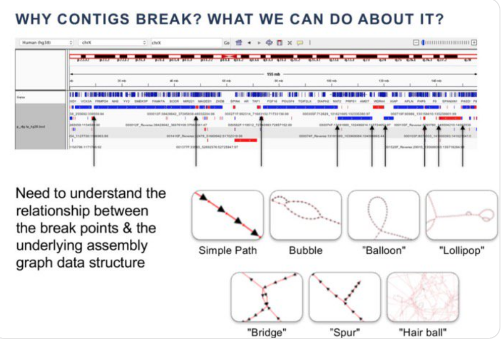

In the [previous lesson](08_bin_completion_with_spacegraphcats.md), we observed that querying our metagenome with a *de novo* assembled genome returned a neighborhood XX% larger than the query.
Now we will assemble our query neighborhood and determine whether it contains additional amino acid sequences that were not in our query.

## But wasn't assembly a problem?

Yes! As we discussed last lesson, *de novo* assembly and binning are often part of the problem -- 
assemblers don't pick a path when they're faced with too many options, and output small, fragmented contigs instead.
Look at the graphic below. 
It depicts some common structures in cDBGs that can lead to breaks in contigs.



A lot of variation that occurs in sequences occurs at the *nucleotide* level. 
This is in part attributable to [third base pair wobble](https://www.tandfonline.com/doi/full/10.1080/15476286.2017.1356562),
which leads to [silent variation in nucleotide sequences](https://www.nature.com/articles/s41592-019-0437-4) that confounds nucleotide assembly.
One way to circumvent assembly problems that arise from sequence variation is to assemble in amino acid space.
Amino acid assemblers translate nucleotide reads into amino acid space, and then find overlaps between the translated amino acid sequences to assemble open reading frames.
In the context of metagenomes, this results in many more assembled open reading frames that can then be analyzed for their functional potential.

We will use the [PLASS](https://www.nature.com/articles/s41592-019-0437-4) amino acid assembler to assemble our query neighborhood. 
Then, we will compare the proteins we assembled with PLASS to those in the original query. 

## Running PLASS and formatting the output

First, start an srun session

```
srun -p bmh -J plass -t 24:00:00 --mem=8gb -c 1 --pty bash
```

Then, we can install PLASS into our `dib_rotation` environment.

```
conda activate dib_rotation
conda install plass
```
Now we can run PLASS!

```
cd ~/2020_rotation_project
mkdir -p plass
cd plass
ln -s SRR1976948_k31_r1_search_oh0/*.reads.fa.gz .
plass assemble *.reads.fa.gz query_nbhd_plass.fa
```

When PLASS finishes, we have to do quite a bit of formatting. 

First, PLASS adds `*` to the end of each amino acid sequence to indicate stop codons.
Most tools don't recognize this as a valid amino acid encoding, so we have to remove this character.
We'll download a script and then run it to remove this stop codon.

```
wget https://raw.githubusercontent.com/spacegraphcats/2018-paper-spacegraphcats/master/pipeline-base/scripts/remove-stop-plass.py
remove-stop-plass.py query_nbhd_plass.fa
```

Next, PLASS also outputs identical amino acid sequences when the underlying nucleotide sequences that led to the amino acid sequences are different.
These are redundant and we don't need them, so we can remove them using a tool called CD-HIT.
CD-HIT clusters sequences at a user-specified identity, and selects a representative sequence for each cluster.
In our case, we can cluster at 100% identity and that will reduce the number of amino acid sequences in our final output file.

First, install CD-HIT. Make sure you're in your `dib_rotation` environment.
If you're not, run `conda activate dib_rotation`.

```
conda install cdhit
```

Then run CD-HIT

```
cd-hit -c 1 -i  query_nbhd_plass.fa.nostop.fa -o  query_nbhd_plass.cdhit.fa
```

PLASS outputs sequences with unique identifiers, but they're not unique before the first space that occurs in the header.
Many programs truncate amino acid (or any fasta sequence names) at the first space, so we need to make the headers unique before the first space occurs. 

```
wget https://raw.githubusercontent.com/dib-lab/dib_rotation/master/scripts/format_plass_headers.py
format_plass_headers.py query_nbhd_plass.cdhit.fa query_nbhd_plass.clean.fa
```

## Comparing amino acid sequences in our neighborhood to those in the query

Let's compare the amino acid sequences in our neighborhood to those in the query.

First, download amino acid sequences in the query. 
Not every GenBank record has translated amino acid sequences, but because ours does, we can use them.

```
cd ~/2020_rotation_project
mkdir -p blast
cd blast
wget ftp://ftp.ncbi.nlm.nih.gov/genomes/all/GCA/001/508/995/GCA_001508995.1_ASM150899v1/GCA_001508995.1_ASM150899v1_protein.faa.gz
gunzip GCA_001508995.1_ASM150899v1_protein.faa.gz
```

There are many, many ways that we could compare the amino acid sequences between the two sequences. 

We could use `sourmash compute` with the `--protein` flag to generate signatures for both of our amino acid fasta files, and then use `sourmash compare` to compare them. 
Since we've used `sourmash` quite a bit, let's take a different approach that will give us a more detailed answer.

We'll use BLAST to compare all of the protein sequences in our PLASS assembly to all of the protein sequences in the GenBank assembly. 
We just downloaded the GenBank assembly amino acid sequences to our `blast` folder, let's link in our PLASS amino acid assembly.

```
ln -s ../plass/query_nbhd_plass.clean.fa .
```

Next, we need to install BLAST into our environment.
Make sure you're in your `dib_rotation` environment.
If you're not, run `conda activate dib_rotation`.

```
conda install blast
```

Now we can use BLAST to compare our two sequences!
BLAST has many options for comparing sequences.
`blastn` compares nucleotide sequences against nucleotide squences.
`blastp` compares protein sequences against protein sequences.
`blastx` compares nucleotide sequences against protein sequences.
`tblastn` compares protein sequences against nucleotide sequences.
We'll use `blastp` since we are dealing with two amino acid fasta files.
We'll also use the `-query`/`-subject` format for our BLAST command instead of using a BLAST database.
This will allow us to BLAST two sequences together without needing to build our own database.
(If you would like to learn how to build a BLAST database, see [this tutorial](https://angus.readthedocs.io/en/2019/cloud_computing_intro.html)).
We will also use the flag `-outfmt 6` which will give us our results in tab-delineated format.

```
blastp -query query_nbhd_plass.clean.fa -subject GCA_001508995.1_ASM150899v1_protein.faa -outfmt 6 -out query_nbhd_blast.tab
```

Now that we have our BLAST results, we can analyze them in R.
(Feel free to re-implement a similar approach in python if you don't like R!)
We are looking for matches that are 100% identical between our query and our subject.

R has a lot of dependencies. 
Let's make a new environment to keep those packages separate from our other tools.
We'll install two R packages, which will bring along all of the R dependencies.
`dplyr` has a set of functions for manipulating and formatting dataframes (like our BLAST table),
and `Biostrings` makes reading amino acid sequences simple.

```
conda deactivate
conda create -n renv  r-dplyr=0.8.3  bioconductor-biostrings=2.54.0 
```

Once installed, activate the new environment
```
conda activate renv
```

and then start an R session by running:
```
R
```

Once inside of the R session, you should see a new prompt that looks like this: `>`

Run the following code to analyze the BLAST results.
Look at the comments to see what each line of code does.

```
library(Biostrings)  # import biostrings functions into current environment
library(dplyr)       # import dplyr functions into current environment

nbhd <- <- readAAStringSet("query_nbhd_plass.clean.fa") # import the plass nbhd
nbhd_aas <- length(nbhd)                                # get number of AAs in nbhd
blast <- read.table("query_nbhd_blast.tab")             # import blast results

blast_100 <- filter(blast, V3 == 100)    # retain only AAs that were 100%
aas_100 <- length(unique(blast_100$V1))  # count num aas 100% contained

aas_100/nbhd_aas # calculate the percent of AAs from the nbhd that were in the query
```

How many amino acid sequences were added by the neighborhood query and the PLASS assembly?
