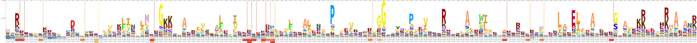

In the [previous lesson](09_assembling_a_nbhd.md), we saw that our neighborhood query + PLASS assembly approach increased the number of amino acid sequences over those in our query by 26%.
What do these amino acid sequences encode? 
Are they strain variants (e.g. a few amino acids different) from those that were already in the query, or do they add new functionality?
In this lesson, we will annotate the amino acid sequences in our PLASS assembly and in the GenBank assembly, and then compare the encoded functions.

As with most things in bioinformatics, there are many ways to annotate amino acid sequences. 
We will be using `kofamscan`, a tool that uses hidden markov models built from KEGG orthologs to assign KEGG ortholog numbers to new amino acid sequences.
Hidden markov models work well for protein annotation because they weight the importance of each amino acid in determining the final assignment.
Look at the figure below.



This figure is a logo depicting the PFAM HMM for rpsG. 
rpsG encodes 30S ribosomal protein S7, and it is a highly conserved protein. 
The HMM was built from hundreds of rpsG protein sequences. 
At each position of the protein, the logo depicts the liklihood of seeing a specific amino acid.
The larger the amino acid is in the logo, the more likely it is to be observed at that position. 
In positions where no amino acid is visible, it is less important which amino acid occurs there.
This encoding is more flexible than something like Hamming distance or BLAST because it incorporates biological importance of amino acid positionality.
This approach works well on novel amino acid sequences that are not closely related to anything currently housed in databases.

kofamscan is a tool released by the KEGG that includes HMMs built from each KEGG ortholog. 
Using kofamscan, we can assign KEGG orthologs to our amino acid sequences. 
This allows us to take advantage of KEGG pathway information to determine if any pathways are more complete in our neighborhood than in our query.

## Running kofamscan

First, start an `srun` session.

```
srun -p bmh -J KO -t 48:00:00 --mem=8gb -c 6 --pty bash
```

kofamscan is not available as a conda package, but being able to use the KEGG framework is important enough to deal with installing the kofamscan package manually.

We'll create a new environment for kofamscan, and use conda to install all of its dependencies.

```
conda create -n kofamscan hmmer parallel ruby
conda activate kofamscan
```

```
cd ~/2020_rotation_project
mkdir -p kofamscan
cd kofamscan
ln -s ../plass/query_nbhd_plass.cdhit.fa .
ln -s ../blast/GCA_001508995.1_ASM150899v1_protein.faa .
```

Then, download the databases and executables for the kofamscan program.

```
wget ftp://ftp.genome.jp/pub/db/kofam/ko_list.gz		          # download the ko list 
wget ftp://ftp.genome.jp/pub/db/kofam/profiles.tar.gz 		    # download the hmm profiles
```

Unzip and untar the relevant files:

```
gunzip ko_list.gz
tar xf profiles.tar.gz
```

kofamscan runs using a config file. 
Using nano or vim (e.g. `nano config.yml`, build a config file that looks like this:

```
# Path to your KO-HMM database
# A database can be a .hmm file, a .hal file or a directory in which
# .hmm files are. Omit the extension if it is .hal or .hmm file
profile: ./profiles

# Path to the KO list file
ko_list: ko_list

# Path to an executable file of hmmsearch
# You do not have to set this if it is in your $PATH
# hmmsearch: /usr/local/bin/hmmsearch

# Path to an executable file of GNU parallel
# You do not have to set this if it is in your $PATH
# parallel: /usr/local/bin/parallel

# Number of hmmsearch processes to be run parallelly
cpu: 6
```

Now we can run kofamscan!
We'll run it on our PLASS assembly, and then we will run it on the GenBank assembly.

```
exec_annotation -f mapper -o query_nbhd_plass.clean_kofamscan.txt query_nbhd_plass.cdhit.fa
```

```
exec_annotation -f mapper -o GCA_001508995.1_ASM150899v1_protein_kofamscan.txt GCA_001508995.1_ASM150899v1_protein.faa 
```

This will output two files that look something like this. 
The protein name occurs in the left column; this is derived from the amino acid header names.
If a KEGG ortholog was able to be assigned to the protein, it occurs in the right column.

```
NORP88_1
NORP88_2
NORP88_3	K01869
NORP88_4
NORP88_5
NORP88_6	K07082
NORP88_7
NORP88_8	K07448
NORP88_9
NORP88_10	K07507
```

Lastly, use [KEGGDecoder](https://github.com/bjtully/BioData/tree/master/KEGGDecoder) to visualize the differences in KEGG pathways. 

```
conda install pip
pip install KEGGDecoder
```

Combine the kofamscan output files

```
cat *_kofamscan.txt > kofamscan_results.txt
```

And run KEGGDecoder
```
KEGG-decoder -i kofamscan_results.txt -o kegg_decoder_out --vizoption static
```

Transfer the output to your local computer using `scp`, and look at the results!

## Challenge: metabolishmm

Above, we use kofamscan to assign KEGG orthologs to our amino acid sequences. 
There are other tools that would allow us look at the metabolic capabilities encoded in amino acid sequences.
One such tool is metabolishm.
Try using the metabolishmm [tutorial](https://github.com/elizabethmcd/metabolisHMM/wiki/Subsurface-Aquifer-Tutorial)
and [wiki documentation](https://github.com/elizabethmcd/metabolisHMM/wiki) to install metabolishmm into its own environment, and to run the tool on our neighborhood and our query.


> **Side note - using prokka to generate amino acid sequences from nucleotide sequences**    
>
> So far, we've been using the amino acid sequences from GenBank.   
> What if we were working with a genome or bin that did not have   
> that did not have amino acid sequences associated with it yet?    
> We can generate amino acid sequences from nucleotide sequences,   
> as well as first-pass annotations, using a tool called `prokka`.  
> We can use conda to install prokka: `conda install prokka`  
> To run prokka on a bin derived from a metagenome, use:  
> ```
> prokka {input} --outdir {outdir} --prefix {bin} --metagenome --force --locustag {bin}
> ```
