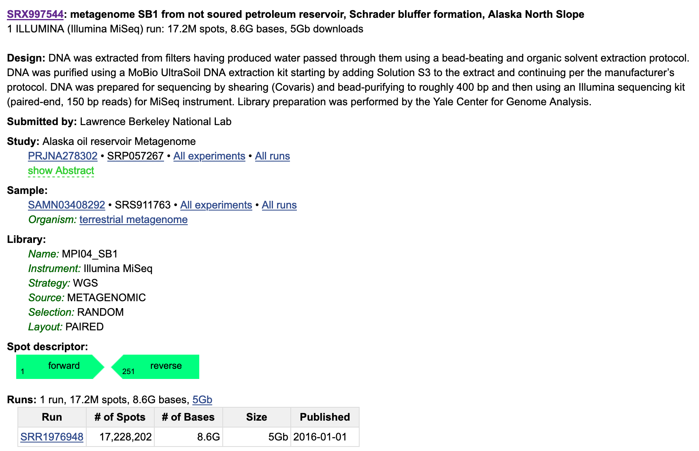
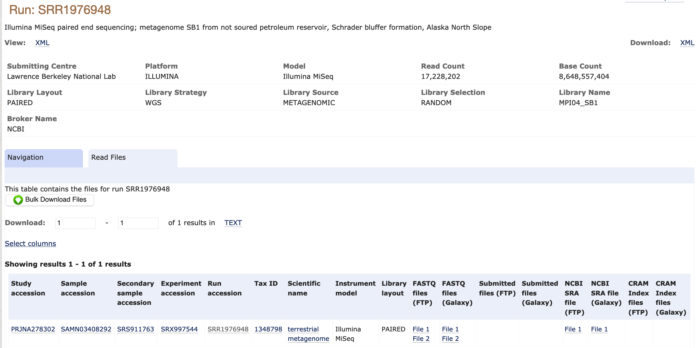

We will be working with a metagenome sample from an Alaskan Oil Reservoir sequenced in [this study](https://mbio.asm.org/content/7/1/e01669-15).
The sample is named SB1 because it was sampled from the Schrader Bluff Formation.

We will start working with this sample by downloading it. 
Then, we will assess its quality using FastQC. 

## Finding Sequencing Data

There are many ways to discover and download sequencing data. 
In this case, we are using a sample that was detailed in a paper. 
When this is the case, it is usually easiest to find this sample by looking at the paper itself. 
We can see on Page 9 that the authors have documented the accession numbers of their samples (metagenome-assembled genomes and raw sequences) in the paper:


We can use this information to find a link to use to download the raw sequencing data. 
We see that the raw reads are in GenBank under the accession `SRP057267`. 
Let's navigate to GenBank and see what these files look like there.
Searching all databases for `SRP057267`, we find the following result: https://www.ncbi.nlm.nih.gov/sra/SRP057267
We see that the raw reads are in the Sequence Read Archive. 
The last sample is the one we are interested in: `metagenome SB1 from not soured petroleum reservoir, Schrader bluffer formation, Alaska North Slope`. 

Clicking on this link, we see the following description:



If we click on the run link `SRR1976948`, this takes us to the SRA Run Browser. 
The Run Browser provides some information about the raw reads, including a estimate of taxonomic composition. 
It's worth it to explore the Run Browser, but there are easier ways to download data than using the SRA. 
The SRA is mirrored by the [European Nucleotide Archive (ENA)](https://www.ebi.ac.uk/ena).
We can search for our accession number on the ENA as well. 
If we click on the result, we see the following page:



## Downloading Sequencing Data

We can click directly on the `FASTQ files (FTP)` to download them to our computer.
Alternative, we can copy the links and use these to download the files to a remote computer like Farm.

Before we download these files, let's set up a directory structure that will help us stay organized.

```
cd ~
mkdir 2020_rotation_project
cd 2020_rotation_project
mkdir raw_data
cd raw_data
```

Then, we can download the data into our `raw_data` directory.

```
wget ftp://ftp.sra.ebi.ac.uk/vol1/fastq/SRR197/008/SRR1976948/SRR1976948_1.fastq.gz
wget ftp://ftp.sra.ebi.ac.uk/vol1/fastq/SRR197/008/SRR1976948/SRR1976948_2.fastq.gz
```

## FASTQ format

Although it looks complicated (and it is), we can understand the
[fastq](https://en.wikipedia.org/wiki/FASTQ_format) format with a little decoding. Some rules about the format
include...

|Line|Description|
|----|-----------|
|1|Always begins with '@' and then information about the read|
|2|The actual DNA sequence|
|3|Always begins with a '+' and sometimes the same info in line 1|
|4|Has a string of characters which represent the quality scores; must have same number of characters as line 2|

We can view the first complete read in a fastq file by using `head` to look at the first four lines.
Because the our files are gzipped, we first temporarily decompress them with `zcat`.

```
zcat SRR1976948_2.fastq.gz | head -n 4
```

Using a different SRR accession for example purposes, the first four lines of the file look something like this:

```
@SRR2584863.1 HWI-ST957:244:H73TDADXX:1:1101:4712:2181/1
TTCACATCCTGACCATTCAGTTGAGCAAAATAGTTCTTCAGTGCCTGTTTAACCGAGTCACGCAGGGGTTTTTGGGTTACCTGATCCTGAGAGTTAACGGTAGAAACGGTCAGTACGTCAGAATTTACGCGTTGTTCGAACATAGTTCTG
+
CCCFFFFFGHHHHJIJJJJIJJJIIJJJJIIIJJGFIIIJEDDFEGGJIFHHJIJJDECCGGEGIIJFHFFFACD:BBBDDACCCCAA@@CA@C>C3>@5(8&>C:9?8+89<4(:83825C(:A#########################
```

Line 4 shows the quality for each nucleotide in the read. 
Quality is interpreted as the probability of an incorrect base call (e.g. 1 in 10) or, equivalently, the base call accuracy (e.g. 90%). 
To make it possible to line up each individual nucleotide with its quality score, the numerical score is converted into a code where each individual character represents the numerical quality score for an individual nucleotide. 'For example, in the line above, the quality score line is: 

```
CCCFFFFFGHHHHJIJJJJIJJJIIJJJJIIIJJGFIIIJEDDFEGGJIFHHJIJJDECCGGEGIIJFHFFFACD:BBBDDACCCCAA@@CA@C>C3>@5(8&>C:9?8+89<4(:83825C(:A#########################
```

The numerical value assigned to each of these characters depends on the  sequencing platform that generated the reads. The sequencing machine used to generate our data  uses the standard Sanger quality PHRED score encoding, using Illumina version 1.8 onwards.
Each character is assigned a quality score between 0 and 41 as shown in the chart below.

```
Quality encoding: !"#$%&'()*+,-./0123456789:;<=>?@ABCDEFGHIJ
                   |         |         |         |         |
Quality score:    01........11........21........31........41                                
```


Each quality score represents the probability that the corresponding nucleotide call is incorrect. 
This quality score is logarithmically based, so a quality score of 10 reflects a base call accuracy of 90%, but a quality score of 20 reflects a base call accuracy of 99%. 
These probability values are the results from the base calling algorithm and depend on how much signal was captured for the base incorporation. 

Looking back at our example read: 

```
@SRR2584863.1 HWI-ST957:244:H73TDADXX:1:1101:4712:2181/1
TTCACATCCTGACCATTCAGTTGAGCAAAATAGTTCTTCAGTGCCTGTTTAACCGAGTCACGCAGGGGTTTTTGGGTTACCTGATCCTGAGAGTTAACGGTAGAAACGGTCAGTACGTCAGAATTTACGCGTTGTTCGAACATAGTTCTG
+
CCCFFFFFGHHHHJIJJJJIJJJIIJJJJIIIJJGFIIIJEDDFEGGJIFHHJIJJDECCGGEGIIJFHFFFACD:BBBDDACCCCAA@@CA@C>C3>@5(8&>C:9?8+89<4(:83825C(:A#########################
```

we can now see that there is a range of quality scores, but that the end of the sequence is very poor (`#` = a quality score of 2). 
How does the first read in `SRR1976948_2.fastq.gz` compare to this example?

## Assessing Quality with FastQC

In real life, you won't be assessing the quality of your reads by visually inspecting your FASTQ files. 
Rather, you'll be using a software program to assess read quality and filter out poor quality reads. 
We'll first use a program called [FastQC](http://www.bioinformatics.babraham.ac.uk/projects/fastqc/) to visualize the quality of our reads. 

FastQC has a number of features which can give you a quick impression of any problems your data may have, so you can take these issues into consideration before moving forward with your analyses. 
Rather than looking at quality scores for each individual read, FastQC looks at quality collectively across all reads within a sample. 
The image below shows one FastQC-generated plot that indicatesa very high quality sample:


The x-axis displays the base position in the read, and the y-axis shows quality scores. In this 
example, the sample contains reads that are 40 bp long. This is much shorter than the reads we 
are working with in our workflow. For each position, there is a box-and-whisker plot showing 
the distribution of quality scores for all reads at that position. The horizontal red line 
indicates the median quality score and the yellow box shows the 1st to 
3rd quartile range. This means that 50% of reads have a quality score that falls within the 
range of the yellow box at that position. The whiskers show the absolute range, which covers 
the lowest (0th quartile) to highest (4th quartile) values.

For each position in this sample, the quality values do not drop much lower than 32. This 
is a high quality score. The plot background is also color-coded to identify good (green),
acceptable (yellow), and bad (red) quality scores.

Now let's take a look at a quality plot on the other end of the spectrum. 


Here, we see positions within the read in which the boxes span a much wider range. 
Also, quality scores drop quite low into the "bad" range, particularly on the tail end of the reads. 
The FastQC tool produces several other diagnostic plots to assess sample quality, in addition to the one plotted above. 

## Running FastQC  

We will now assess the quality of the reads that we downloaded. First, make sure you're still in the `raw_data` directory

```
cd ~/2020_rotation_project/raw_data
```

Then, use conda to install fastqc. Make sure you activate your rotation environment.  (We're using the `mamba` command instead of `conda` because it's faster.)

```
conda activate dib_rotation
mamba install -y fastqc
```

FastQC can accept multiple file names as input, and on both zipped and unzipped files, so we can use the \*.fastq* wildcard to run FastQC on all of the FASTQ files in this directory.

```
fastqc *.fastq* 
```

The FastQC program has created several new files within our directory. 
For each input FASTQ file, FastQC has created a `.zip` file and a
`.html` file. The `.zip` file extension indicates that this is 
actually a compressed set of multiple output files. We'll be working
with these output files soon. The `.html` file is a stable webpage
displaying the summary report for each of our samples.

## Transferring data from Farm to your computer

To transfer a file from a remote server to our own machines, we will use `scp`. 
To learn more about `scp`, see the bottom of [this tutorial](https://datacarpentry.org/shell-genomics/05-writing-scripts).


We've currently been running commands on a terminal open on `farm`. 
In order to transfer to our own computer, we want a terminal open on our local computer. 
There are two ways to do this: open a second terminal tab/window, or close tmux and exit farm. Let's make a new window.

Once you've opened a second terminal window, you need to make sure you know what file system each window is pointing to.
If you're on farm (the original window), the prompt should say `(dib_rotation) USERNAME@<SRUN NODE>`. Your new window should
just have `USERNAME@<YOUR COMPUTER NAME>`. There will be no `(dib_rotation)` unless you've created and activated that conda
environment on your local computer as well.

Now, from the terminal open to your local computer, copy over the fastqc HTML files using `scp`, a "secure copy" program.

```
scp -i /path/to/key/file username@farm.cse.ucdavis.edu:~/2020_rotation_project/raw_data/*.html ./
```

>   - replace /path/to/key/file with the path to your ssh keygen file, created during setup
>   - both `cp` and `scp` commands use the format: `cp <FILE_TO_TRANSFER> <DESTINATION>`. 

This command will copy the files down to the directory that you're sitting in on your home computer. If you're on a windows machine,
you may need to copy it from your linux partition over to your windows partition (perhaps most easily accessible in a downloads folder
or your desktop).

Once the file is on your local computer, double click on it and it will open in your browser. 
You can now explore the FastQC output.

## Decoding the FastQC Output

We've now looked at quite a few "Per base sequence quality" FastQC graphs, but there are nine other graphs that we haven't talked about! 
Below we have provided a brief overview of interpretations for each of these plots. 
For more information, please see the FastQC documentation [here](https://www.bioinformatics.babraham.ac.uk/projects/fastqc/Help/).

+ [**Per tile sequence quality**](https://www.bioinformatics.babraham.ac.uk/projects/fastqc/Help/3%20Analysis%20Modules/12%20Per%20Tile%20Sequence%20Quality.html): the machines that perform sequencing are divided into tiles. This plot displays patterns in base quality along these tiles. Consistently low scores are often found around the edges, but hot spots can also occur in the middle if an air bubble was introduced at some point during the run. 
+ [**Per sequence quality scores**](https://www.bioinformatics.babraham.ac.uk/projects/fastqc/Help/3%20Analysis%20Modules/3%20Per%20Sequence%20Quality%20Scores.html): a density plot of quality for all reads at all positions. This plot shows what quality scores are most common. 
+ [**Per base sequence content**](https://www.bioinformatics.babraham.ac.uk/projects/fastqc/Help/3%20Analysis%20Modules/4%20Per%20Base%20Sequence%20Content.html): plots the proportion of each base position over all of the reads. Typically, we expect to see each base roughly 25% of the time at each position, but this often fails at the beginning or end of the read due to quality or adapter content.
+ [**Per sequence GC content**](https://www.bioinformatics.babraham.ac.uk/projects/fastqc/Help/3%20Analysis%20Modules/5%20Per%20Sequence%20GC%20Content.html): a density plot of average GC content in each of the reads.  
+ [**Per base N content**](https://www.bioinformatics.babraham.ac.uk/projects/fastqc/Help/3%20Analysis%20Modules/6%20Per%20Base%20N%20Content.html): the percent of times that 'N' occurs at a position in all reads. If there is an increase at a particular position, this might indicate that something went wrong during sequencing.  
+ [**Sequence Length Distribution**](https://www.bioinformatics.babraham.ac.uk/projects/fastqc/Help/3%20Analysis%20Modules/7%20Sequence%20Length%20Distribution.html): the distribution of sequence lengths of all reads in the file. If the data is raw, there is often on sharp peak, however if the reads have been trimmed, there may be a distribution of shorter lengths. 
+ [**Sequence Duplication Levels**](https://www.bioinformatics.babraham.ac.uk/projects/fastqc/Help/3%20Analysis%20Modules/8%20Duplicate%20Sequences.html): A distribution of duplicated sequences. In sequencing, we expect most reads to only occur once. If some sequences are occurring more than once, it might indicate enrichment bias (e.g. from PCR). If the samples are high coverage (or RNA-seq or amplicon), this might not be true.  
+ [**Overrepresented sequences**](https://www.bioinformatics.babraham.ac.uk/projects/fastqc/Help/3%20Analysis%20Modules/9%20Overrepresented%20Sequences.html): A list of sequences that occur more frequently than would be expected by chance. 
+ [**Adapter Content**](https://www.bioinformatics.babraham.ac.uk/projects/fastqc/Help/3%20Analysis%20Modules/10%20Adapter%20Content.html): a graph indicating where adapater sequences occur in the reads.
+ [**K-mer Content**](https://www.bioinformatics.babraham.ac.uk/projects/fastqc/Help/3%20Analysis%20Modules/11%20Kmer%20Content.html): a graph showing any sequences which may show a positional bias within the reads.

## Extra Info

if you ever need to download >10 accessions from the SRA, the `sra-toolkit` is a great tool to do this with!
However, we find `sra-toolkit` cumbersome when only a couple accessions need to be downloaded.

